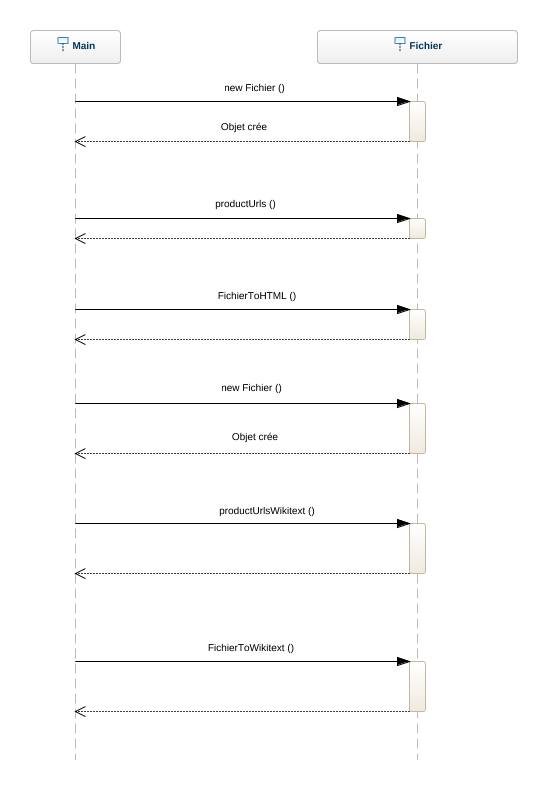

## Design 

This project contains two packages : one "model" which contains all classes and "test" which contains all test classes.

The global architecture is : 

We spotted some issues like “useless” inheritance. On the diagram, we can see “Fichier” extends “Url” which extends “FormatHTML”. Inheritance normally allows to factorize common concepts shared by different subclasses in a single superclass. It allows also to isolate the concepts proper to each subclass and to redefine superclass operations if necessary. 
We observed the code and we realized none of these concepts seemed to be applied. We did not see to what extent “FormatHTML”, “Url” and “Fichier” had so much common concepts. The inheritance did not follow any software logic. Moreover, if we removed the inheritance, the program was running with no difference.
We also spotted unused methods or attributes. We need to check if they have been forgotten or if they are just the beginning of unfinished implementations. After that we will remove unnecessary code to have a clean project.

Some operations do not follow traditional coding conventions. All operations, except constructors should not start with a capital letter. For example, the « PremierSplit() : FormatHTML » method in the FormatHTML class should be written « premierSplit() : FormatHTML ». This problem can be spotted on several operations in the code.
Some class are not correctly named, especially the Url class which can be confused with the java Url object. This class should bear a different name to avoid any misunderstandings.
The project makes the use of a mix between French and English. It is not a correct practice. Some methods are in English like « headToCSV() : ProductionCSV » in the FormatWikiText class. Some are in French like « NombreCol() : int » in the FormatHTML class. Others are using a mix between French and English like the PremierSplit() : FormatHTML method in the FormatHTML class. There is a similar problem with the class names. We should program using a single language (English is a better solution as it is widely spoken, so easily understood by most of foreign developers) to avoid comprehension problems.
A few attribute names should be changed because their name is not explicit. For example, the attribute « urlUrl : Url » of the « Fichier » class constructor. 
Even if not causing technical difficulties, these coding conventions issues can cause misunderstanding for future developers and should be correcting using code refactoring with the IDE.

  
# Dynamic model
  
Actually, the project starts when Main is executed. This class allows to start a Wikipedia table extraction from two different formats : HTML or Wikitext. 

The nominal scenario represents a Main execution without errors :
 

First a "Fichier" object is created. This object allows to do operations on an extracted Wikipedia page.

The first method "productUrls()" lists all urls in a file. After the method "fichierToHTML ()" realizes HTML extraction. In the second part a new "Fichier" object is created and the method "productUrlsWikitext" creates a file with all Wikitext urls. At the end, "FichierToWikitext" realizes the Wikitext extraction.

# Tests Results

Tests results realised on 10/08/19

| <h3>Test name</h3>        |  <h3>Finale Description</h3>      |
| ------|-----|
| **TestCSV**  	| Empty 	|
| **TestFichier**  	|||
| 
TestRemove2 
	| OK 	|
| TestUrlFromFile  	| OK 	|
| TestAdd2  	| OK 	|
| TestToString  	| OK 	|
| TestRemove  	| OK 	|
| TestReadFile  	| Failed => Assertion Error : <ul><li>Expected : 312</li> <li>Actual : 314</li></ul>	|
| TestAdd  	| OK 	|
| **TestHTML**  	| |
| Testhtml  	| Error => Array Index Out Of Bounds Exception : Index 1 out of bounds for lenght 1 	|
| TestTitle  	| Failed => Comparison failure 	|
| TestNbColonnes  	| Failed => Assertion Error : <ul><li>Expected : 1</li> <li>Actual : 10</li></ul> 	|
| **TestPDL**	| |
|  TestWiki	| Error  => null pointer exception	|
| **TestURL**	| |
|  TestToHTML  	|  OK	|
|  TestValideUrl  	| Failed => AssertionError 	|
|  TestNonValidUrl  	| OK 	|
| TestRedirectUrl  	| Failed => Assertion Error : lien redirigé	|
| **TestWikiText**  	| |
| TestNbLignes  	| Failed => Assertion Error : <ul><li>Expected : 0</li> <li>Actual : 9</li></ul>	|
| TestNewUrl  	| OK	|
| TestNbTableau  	| OK	|

